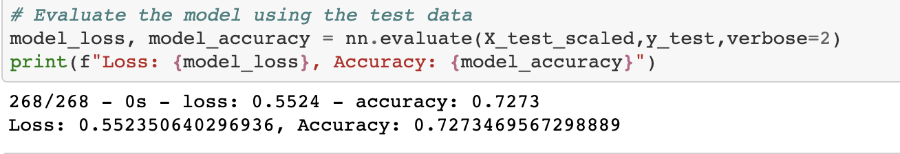

# Neural Network Charity Analysis
## Overview of the loan prediction risk analysis:
The purpose of this analysis was to create a binary classifier that is capable of predicting whether applicants will be successful if funded by Alphabet Soup.

## Results:
## Data Preprocessing
What variable(s) are considered the target(s) for your model?
* IS_SUCCESSFUL

What variable(s) are considered to be the features for your model?
* USE_CASE
* ORGANIZATION STATUS
* INCOME_AMT
* SPECIAL_CONSIDERATIONS
* ASK_AMT
* APPLICATION_TYPE
* AFFILIATION
* CLASSIFICATION

What variable(s) are neither targets nor features, and should be removed from the input data?
* EIN
* NAME

## Compiling, Training, and Evaluating the Model

How many neurons, layers, and activation functions did you select for your neural network model, and why?
* 1 layer was used

Were you able to achieve the target model performance?

* Yes

What steps did you take to try and increase model performance?

* By re-configuring the neurons and layers

## Summary:
In conclusion, these were the results after evaluating the model:

